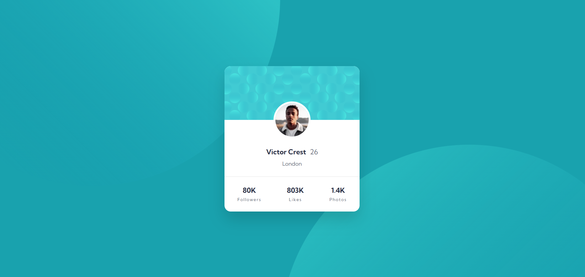

# Frontend Mentor - Profile card component solution

This is a solution to the [Profile card component challenge on Frontend Mentor](https://www.frontendmentor.io/challenges/profile-card-component-cfArpWshJ). Frontend Mentor challenges help you improve your coding skills by building realistic projects. 

## Table of contents

- [Overview](#overview)
  - [The challenge](#the-challenge)
  - [Screenshot](#screenshot)
  - [Links](#links)
- [My process](#my-process)
  - [Built with](#built-with)
  - [What I learned](#what-i-learned)
  - [Continued development](#continued-development)
  - [Useful resources](#useful-resources)
  - [AI Collaboration](#ai-collaboration)
- [Author](#author)
- [Acknowledgments](#acknowledgments)

## Overview

### The challenge

- Build out the project to the designs provided

### Screenshot of my code



### Links

- My Solution URL: [solution](https://www.frontendmentor.io/solutions/profile-card-component-FOcXsk96hj)
- My Live Site URL: [live site](https://thandokuhlemdluli29s-lang.github.io/Profile-Card-Component/)

## My process

### Built with

- Semantic HTML5 markup
- CSS custom properties
- Flexbox
- Mobile-first workflow

### What I learned

While building this project, I improved my understanding of responsive layouts and image positioning.

Some of the concepts I practised include:

- Using Flexbox to center content both vertically and horizontally.
- Positioning elements with `position: absolute` and `position: relative`.
- Creating responsive layouts using media queries.
- Using multiple background images with CSS instead of extra HTML elements.
- Structuring HTML with semantic elements.

One section I was particularly proud of was positioning the profile image over the card header.

To see how you can add code snippets, see below:

```html
<div class="bubble-section">
  
  
</div>
```
```css
.profile-info p:last-child {
    margin-top: 10px;
    margin-bottom: 24px;

    color: hsl(227, 10%, 46%);
    font-size: .9rem;
}
```

### Continued development

In future projects, I would like to continue improving my knowledge of:

- CSS Grid for more advanced layouts.
- Responsive design techniques.
- CSS positioning without relying on fixed pixel values.
- Writing cleaner and more maintainable CSS.


### Useful resources

- [Cisco HTML Essentials](https://www.netacad.com/courses/html-essentials?courseLang=en-US) - This helped me to learn about HTML elements.

### AI Collaboration

I used ChatGPT during this project to help me:

- Debug CSS layout issues.
- Understand how to position decorative background images without creating scrollbars.
- Improve the responsiveness of the profile card.
- Learn better practices for using Flexbox and CSS positioning.

The explanations helped me understand *why* certain solutions worked instead of simply copying code, which improved my overall understanding of HTML and CSS.

## Author

- Frontend Mentor - [@thandokuhlemdluli29s-lang](https://www.frontendmentor.io/profile/thandokuhlemdluli29s-lang)

## Acknowledgments

I would like to thank my instructor for providing guidance whenever I got stuck during this project. Their explanations helped me better understand HTML and CSS concepts.

I also used ChatGPT as a learning tool to help debug issues, understand CSS positioning, improve responsiveness, and learn different approaches to solving layout problems. The explanations helped me understand the concepts rather than simply copying solutions.
